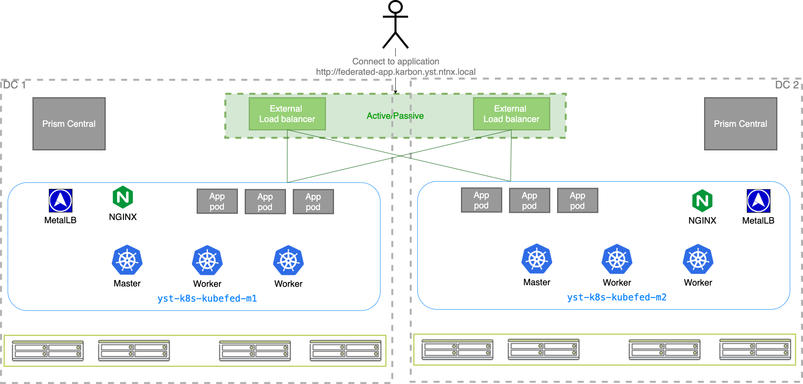
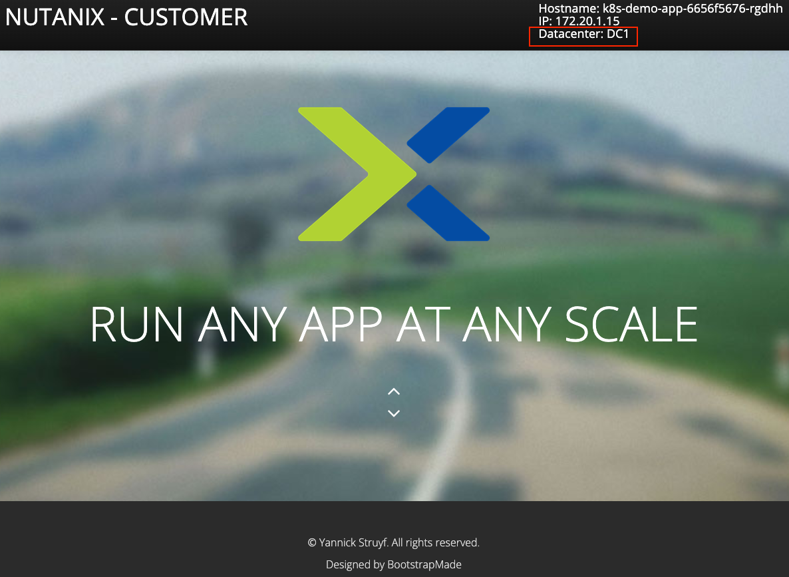
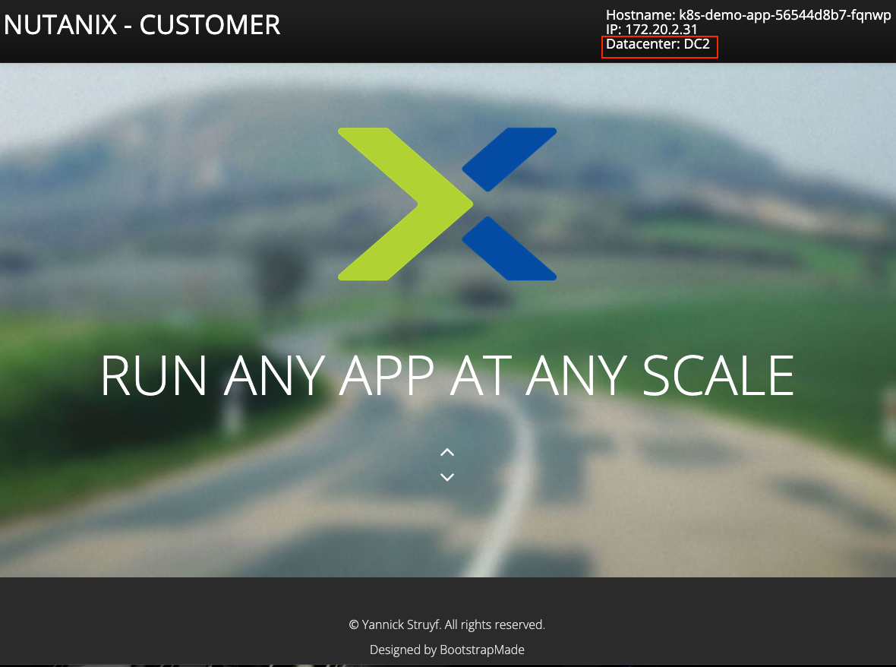

# Kubernetes cluster federation on Nutanix Karbon

Provisioning Kubernetes clusters on top of Nutanix AHV is very easy using Nutanix Karbon. It only takes a few clicks and a bit of waiting to spin up a new production-ready container environment.
This document shows on how you can use federation to run Nutanix Karbon across multiple datacenters and constantly deploy applications in multiple datacenters. In this document we will use KubeFed (https://github.com/kubernetes-sigs/kubefed) for the federation.

All KubeFed files and code can be found in following git repo:<br/>
https://github.com/yannickstruyf3/nutanix-karbon-kubefed

The application code can be found here:<br/>https://github.com/yannickstruyf3/nutanix-demo-webapp


# General overview
We will use two different Nutanix clusters each connected to its own Prism Central to simulate two seperate datacenters. In the current setup we have a stretched layer-2 network. In each datacenter we have one Kubernetes cluster (yst-k8s-kubefed-m1 and yst-k8s-kubefed-m2) deployed using Karbon. We also require a load balancer to redirect traffic to the Kubernetes clusters (DNS round-robin is also an option if you don't want to use a load balancer). This load balancer will be the main entrypoint of our application. In this setup the load balancer is pointed to the Ingress IP of each Kubernetes cluster.
Below you can see a visual representation of the setup:




In each Kubernetes cluster we already have a load balancer installed (MetalLB) and an ingress (NGINX) is also present.

Before going to the next section, it is advised to add both Kubernetes clusters to your kubectl config file. 

# Installing and configuring KubeFed 
First we will install KubeFed in one of our clusters. We will use cluster `yst-k8s-kubefed-m1` for the installation. This Kubernetes cluster will now be referenced to as the `host` cluster.

The installation of KubeFed uses Helm. Make sure you have Helm version 2 installed. If you do not want to install Helm on your Kubernetes clusters, you can follow the steps on this link to use tillerless Helm: https://next.nutanix.com/karbon-kubernetes-service-30/tillerless-helm-on-nutanix-karbon-31334

First step is to add the KubeFed repo to Helm:
```
helm repo add kubefed-charts https://raw.githubusercontent.com/kubernetes-sigs/kubefed/master/charts
```
Output:
```
"kubefed-charts" has been added to your repositories
```

Verify if the repository is added:
```
helm repo list
```
Output:
```
NAME            URL                                                                                                   
kubefed-charts  https://raw.githubusercontent.com/kubernetes-sigs/kubefed/master/charts
```
Next we need to find the correct version of KubeFed we will install.
```
helm search kubefed --devel
```
Output:
```
NAME                            CHART VERSION   APP VERSION     DESCRIPTION                        
kubefed-charts/kubefed          0.2.0-alpha.1                   KubeFed helm chart                 
kubefed-charts/federation-v2    0.0.10                          Kubernetes Federation V2 helm chart
```
In this case we will install `0.2.0-alpha.1`.
If you are sure you are using the correct kubectl context (pointing to your first Kubernetes cluster), we are ready to install the chart.

```
helm install kubefed-charts/kubefed --name kubefed --version=0.2.0-alpha.1 --namespace kube-federation-system --devel
```
Output:
```
NAME:   kubefed
LAST DEPLOYED: Thu Apr 16 10:50:37 2020
NAMESPACE: kube-federation-system
STATUS: DEPLOYED

RESOURCES:
==> v1/ClusterRole
NAME                                AGE
kubefed-admin                       1s
kubefed-edit                        1s
kubefed-role                        1s
kubefed-view                        1s
system:kubefed:admission-requester  1s

###
Removed some output
###

==> v1beta1/ValidatingWebhookConfiguration
NAME                         CREATED AT
validations.core.kubefed.io  2020-04-16T08:50:42Z
```

We can now validate if the installation was successful.
First check if the `kube-federation-system` namespace exists.
```
kubectl get ns
```
Output:
```
NAME                     STATUS   AGE
default                  Active   14h
ingress-nginx            Active   13h
kube-federation-system   Active   84
kube-node-lease          Active   14h
kube-public              Active   14h
kube-system              Active   14h
kubernetes-dashboard     Active   13h
metallb-system           Active   13h
ntnx-system              Active   14h
test-app                 Active   13h
```

If the namespace is created, check if the pods are running.

```
kubectl get pods -n kube-federation-system
```
Output:
```
NAME                                         READY   STATUS    RESTARTS   AGE
kubefed-admission-webhook-566d99c9df-84zf2   1/1     Running   0          2m54s
kubefed-controller-manager-df68f865-6mbqv    1/1     Running   0          2m54s
kubefed-controller-manager-df68f865-cw9v6    1/1     Running   0          2m54s
```
Now we have a running KubeFed installation. Next step is to add clusters to the federation. 

In this case we have two clusters that we want to add to the federation:
- yst-k8s-kubefed-m1
- yst-k8s-kubefed-m2

A cluster can be added by invoking following command:
`kubefedctl join <cluster_name_federation> --cluster-context <kubeconfig_target_cluster_context> --host-cluster-context <kubeconfig_host_cluster_context> --v=2`

In order to invoke the command, we have two prerequisites: 
- Have the `kubefedctl` binary. This can be downloaded on this page: 
https://github.com/kubernetes-sigs/kubefed/releases (scroll down to assets). Unzip the file and add it to your PATH.
- Need to know the name of our contexts in our kubeconfig file. If you are unsure of the names, you can use a  tool called kubectx (https://github.com/ahmetb/kubectx) to show the contexts and also to switch between them.

```
kubectx
```
Output:
```
yst-k8s-kubefed-m1-context
yst-k8s-kubefed-m2-context
```

First add the `host` cluster to the federation:
```
kubefedctl join yst-k8s-kubefed-m1-context --cluster-context yst-k8s-kubefed-m1-context --host-cluster-context yst-k8s-kubefed-m1-context --v=2
```
Output:
```
I0416 11:06:54.866804   61777 join.go:159] Args and flags: name yst-k8s-kubefed-m1-context, host: yst-k8s-kubefed-m1-context, host-system-namespace: kube-federation-system, kubeconfig: , cluster-context: yst-k8s-kubefed-m1-context, secret-name: , dry-run: false
I0416 11:06:55.277404   61777 join.go:240] Performing preflight checks.

###
Removed some output
###

I0416 11:06:55.607917   61777 join.go:878] Created secret in host cluster named: yst-k8s-kubefed-m1-context-kwhhj
I0416 11:06:55.674512   61777 join.go:282] Created federated cluster resource
```

Joining the second cluster to the federation:
```
kubefedctl join yst-k8s-kubefed-m2-context --cluster-context yst-k8s-kubefed-m2-context --host-cluster-context yst-k8s-kubefed-m1-context --v=2
```
Output:
```
I0416 11:10:14.796286   62385 join.go:159] Args and flags: name yst-k8s-kubefed-m2-context, host: yst-k8s-kubefed-m1-context, host-system-namespace: kube-federation-system, kubeconfig: , cluster-context: yst-k8s-kubefed-m2-context, secret-name: , dry-run: false
I0416 11:10:15.192059   62385 join.go:240] Performing preflight checks.

###
Removed some output
###

I0416 11:10:15.632107   62385 join.go:878] Created secret in host cluster named: yst-k8s-kubefed-m2-context-lqhvc
I0416 11:10:15.705158   62385 join.go:282] Created federated cluster resource
```

Now we have two clusters in our federation. Verify if both clusters are ready:

```
kubectl -n kube-federation-system get kubefedclusters
```
Output:
```
NAME                         AGE     READY
yst-k8s-kubefed-m1-context   4m56s   True
yst-k8s-kubefed-m2-context   96s     True
```


# Provision a federated application

The first step is to create a namespace. Initially we need to create the namespace like you would traditionally do via kubectl. The namespace definition can be found in the `00_namespace.yml` file.

```
kubectl apply -f 00_namespace.yml
```
Output:
```
namespace/federated-app created
```
This creates the namespace on your `host` Kubernetes cluster. Now we need to federate this namespace. The `01_federated_namespace.yml` file holds the definition. This file has been generated by using following command:
```
kubefedctl federate --filename ./00_namespace.yml > 01_federated_namespace.yml
```
The `kubefedctl federate` can transform any resource definition to a federated one. 
Now that we have the federated version of our namespace resource definition, we can apply it.

```
k apply -f 01_federated_namespace.yml 
```
Output:
```
federatednamespace.types.kubefed.io/federated-app created
```
If we now switch to our second `yst-k8s-kubefed-m2-context` cluster we can check if the `federated-app` namespace is created:
```
kubectx yst-k8s-kubefed-m2-context
kubectl get ns
```
Output:
```
NAME                     STATUS   AGE
default                  Active   14h
federated-app            Active   7m19s
ingress-nginx            Active   14h
kube-federation-system   Active   54m
kube-node-lease          Active   14h
kube-public              Active   14h
kube-system              Active   14h
kubernetes-dashboard     Active   14h
metallb-system           Active   14h
ntnx-system              Active   14h
test-app                 Active   14h
```

To deploy a federated application we need to perform the same steps as above. First we need to have a yaml file containing our application resource definitions (`02_deploy_app.yml`) and we can transform that one to a federated definition.
```
kubefedctl federate --filename ./02_deploy_app.yml > 03_federated_deploy_app.yml
```
And we apply the `03_federated_deploy_app.yml` file to provision the application.

**Note:** The `03_federated_deploy_app.yml` file in the git repo also has additional changes applied. See section `Modifying the application` for more info.
```
kubectl apply -f 03_federated_deploy_app.yml
```
Output:
```
federatedservice.types.kubefed.io/k8s-demo-app created
federateddeployment.types.kubefed.io/k8s-demo-app created
federatedingress.types.kubefed.io/nginx-test-ingress created
```

After these steps, the app is provisioned and available via the ingress resources. Now, in order connect to the app, we should point our browser to the load balancer. This loadbalancer will forward traffic to the ingress resources in a round-robin fashion. 

If we refresh a few times, we see that the load balancer points us to ingresses spread over different datacenters.





# Managing the application
Now we have a running application split over two Nutanix Karbon clusters, we can centrally manage the application by modifying the federated resource definitions. 
If you look at the `03_federated_deploy_app.yml` filecontents, the `overrides` and `placement` keys in the `FederatedDeployment` resource are particulary interesting. 

With the `placement` keyword you can point the application to specific Kubernetes clusters. 

With the `overrides` keyword it is possible to modify values specific for each cluster. In this example I modify the `DATACENTER` environment variable value depending on which datacenter the application is deployed. The output of this environment value is shown in the right upper corner of the web application.

If you only want the application to run on DC2, you can simply remove the DC1 cluster from the `placement` section (see `04_federated_deploy_app_single_dc.yml`). 
```
# Pods DC1
No resources found in federated-app namespace.
```
```
# Pods DC2
NAME                           READY   STATUS    RESTARTS   AGE
k8s-demo-app-56544d8b7-v9255   1/1     Running   0          87m
```
Or you can run 10 replicas on DC1 and 1 on DC2 (see `05_federated_deploy_app_multiple_replicas.yml`)
```
# Pods DC1
NAME                           READY   STATUS    RESTARTS   AGE
k8s-demo-app-6656f5676-5pccn   1/1     Running   0          79m
k8s-demo-app-6656f5676-b4h4d   1/1     Running   0          79m
k8s-demo-app-6656f5676-fj8j2   1/1     Running   0          79m
k8s-demo-app-6656f5676-gxp9n   1/1     Running   0          79m
k8s-demo-app-6656f5676-jfl82   1/1     Running   0          79m
k8s-demo-app-6656f5676-ksrw7   1/1     Running   0          79m
k8s-demo-app-6656f5676-rgdhh   1/1     Running   0          79m
k8s-demo-app-6656f5676-rkz6p   1/1     Running   0          79m
k8s-demo-app-6656f5676-vjjqc   1/1     Running   0          79m
k8s-demo-app-6656f5676-zxn95   1/1     Running   0          79m
```
```
# Pods DC2
NAME                           READY   STATUS    RESTARTS   AGE
k8s-demo-app-56544d8b7-64ncq   1/1     Running   0          80m
```

# Summary
Nutanix Karbon offers an easy way to deploy Kubernetes clusters. Using Nutanix Karbon in combination with KubeFed increases the manageability of applications spread over multiple datacenters. 